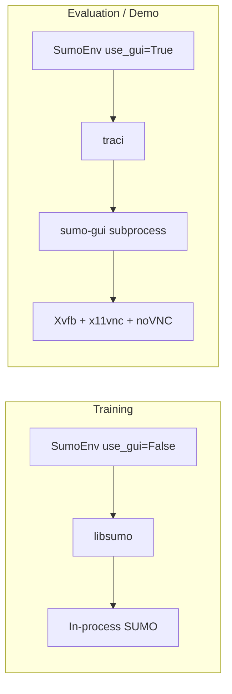

# Technical Architecture & Specifications

**Project: OpenTraffic-MARL**

This document defines the mathematical formulations, environment configurations, neural network
architectures, and training infrastructure used in the OpenTraffic-MARL framework.
It is intended for researchers and reviewers evaluating the reproducibility and technical depth of the project.

---

## 1. Environment Specifications (SUMO)

### 1.1 Simulation Engine

| Parameter | Value |
|-----------|-------|
| **Engine** | SUMO (Simulation of Urban Mobility) v1.25.0 |
| **Training Interface** | `libsumo` — in-process C++ binding, no socket overhead |
| **Evaluation Interface** | `traci` + `sumo-gui` — TCP-based, supports visual rendering |
| **Step Resolution** | 1 second per simulation step |
| **Episode Duration** | 3,600 simulation seconds (1 hour) |
| **Teleportation** | Disabled (`time-to-teleport = -1`) — vehicles never teleport |
| **Waiting Time Memory** | 1,000 seconds |

### 1.2 Network Topology

**Single 4-way signalized intersection** with the following geometry:

```
                 N
                 │
            ═════╪═════  (2 lanes per approach)
                 │
       W ────────┼──────── E
                 │
            ═════╪═════
                 │
                 S
```

| Parameter | Value |
|-----------|-------|
| **Junction Type** | `traffic_light` (node ID: `center`) |
| **Approach Arms** | 4 (North, South, East, West) |
| **Lanes per Approach** | 2 (index 0 and 1) |
| **Arm Length** | 200 meters |
| **Speed Limit** | 13.89 m/s (50 km/h) |
| **Bounding Box** | 400m × 400m |

**Incoming Lanes** (8 total, used as sensor inputs):

```
north_to_center_0, north_to_center_1
south_to_center_0, south_to_center_1
east_to_center_0,  east_to_center_1
west_to_center_0,  west_to_center_1
```

### 1.3 Traffic Light Phases

The junction operates with a 4-phase signal plan:

| Phase Index | Description | Signal State | Duration (default) |
|:-----------:|-------------|:------------:|:------------------:|
| 0 | NS Green | `GGGggrrrrrGGGggrrrrr` | 42s |
| 1 | NS Yellow | `yyyyyrrrrryyyyyrrrrr` | 5s |
| 2 | EW Green | `rrrrrGGGggrrrrrGGGgg` | 42s |
| 3 | EW Yellow | `rrrrryyyyyrrrrryyyyy` | 5s |

> **Note:** The RL agent overrides this default program. Yellow phases are enforced
> programmatically for exactly 5 seconds before every green-to-green transition.

### 1.4 Traffic Flow Dynamics

Vehicle flows are defined with Bernoulli arrival processes (independent per-second spawn probability):

| Flow | Route | Spawn Probability | Approx. Volume |
|------|-------|:-----------------:|:--------------:|
| **Through (N↔S, E↔W)** | Straight | `p = 0.11` | ~396 veh/hr |
| **Turning (all combos)** | Left/Right | `p = 0.04` | ~144 veh/hr |

**Vehicle Type:**

| Parameter | Value |
|-----------|-------|
| Acceleration | 2.6 m/s² |
| Deceleration | 4.5 m/s² |
| Driver imperfection (σ) | 0.5 |
| Vehicle length | 5 m |
| Max speed | 13.89 m/s |

**Total demand:** ~2,160 veh/hr across all approaches (moderate congestion regime).

---

## 2. Agent Architecture (Single Intersection)

### 2.1 Observation Space

The agent receives a **10-dimensional continuous vector** at each decision step:

$$\mathbf{s}_t = \left[ q_1, q_2, \ldots, q_8, \phi_t, \tau_t \right] \in \mathbb{R}^{10}$$

| Index | Feature | Range | Description |
|:-----:|---------|:-----:|-------------|
| 0–7 | $q_i$ | $[0, \infty)$ | Queue length (halting vehicles) on each of the 8 incoming lanes |
| 8 | $\phi_t$ | $\{0, 1\}$ | Current green phase (0 = NS, 1 = EW) |
| 9 | $\tau_t$ | $[0, \infty)$ | Seconds since last phase switch |

```python
observation_space = Box(low=0.0, high=np.inf, shape=(10,), dtype=np.float32)
```

### 2.2 Action Space

$$\mathcal{A} = \{0, 1\}$$

| Action | Effect |
|:------:|--------|
| 0 | **Keep** current green phase |
| 1 | **Switch** — initiate 5-second yellow, then transition to the opposing green |

```python
action_space = Discrete(2)
```

**Decision interval** ($\Delta t$): The agent acts every **5 simulation seconds**.
Between decisions, the simulation advances 5 steps (1s each).
During yellow phases, the agent's action is ignored until the yellow countdown completes.

### 2.3 Reward Function

The agent receives a composite reward signal designed to minimize queue buildup while
discouraging excessive phase switching (flickering):

$$R_t = -Q_t - \alpha \cdot \mathbb{1}[\text{switched}]$$

Where:

| Symbol | Definition | Default Value |
|--------|-----------|:------------:|
| $Q_t$ | $\sum_{i=1}^{8} q_i(t)$ — total halting vehicles across all 8 incoming lanes | — |
| $\alpha$ | Phase switch penalty weight | 2.0 |
| $\mathbb{1}[\text{switched}]$ | Indicator: 1 if the agent chose action 1 (switch), 0 otherwise | — |

> **Design rationale:** The negative queue length provides a smooth, dense gradient signal.
> The switch penalty $\alpha$ prevents the agent from oscillating between phases every 5 seconds,
> which would degrade real-world signal timing. At $\alpha = 2.0$, a switch must reduce the
> queue by at least 2 vehicles to be worthwhile.

### 2.4 Episode Termination

- **Terminated:** When `step_count >= max_steps` (default: 3,600s = 720 decision steps at $\Delta t = 5$)
- **Truncated:** Never (no early termination)

### 2.5 Info Dictionary (Per-Step Metrics)

Each `env.step()` returns an `info` dict with:

| Key | Type | Description |
|-----|------|-------------|
| `queue_length` | float | Total halting vehicles across all lanes |
| `wait_time_total` | float | Sum of per-lane cumulative waiting times (s) |
| `reward` | float | Reward for this step |
| `switch_penalty` | float | Penalty applied (negative α or 0) |
| `throughput` | int | Number of vehicles that completed their trip this step |
| `step` | int | Current simulation time (seconds) |

---

## 3. Neural Network Architecture

### 3.1 Algorithm

**Proximal Policy Optimization (PPO)** via [Stable-Baselines3](https://stable-baselines3.readthedocs.io/).

PPO is a policy-gradient method that uses a clipped surrogate objective to constrain
policy updates, providing monotonic improvement guarantees:

$$L^{CLIP}(\theta) = \hat{\mathbb{E}}_t \left[ \min\left( r_t(\theta) \hat{A}_t, \; \text{clip}(r_t(\theta), 1 - \epsilon, 1 + \epsilon) \hat{A}_t \right) \right]$$

### 3.2 Policy Network

**Architecture:** Multi-Layer Perceptron (MLP) — `MlpPolicy` from SB3.

```
Input (10) → Linear(64) → Tanh → Linear(64) → Tanh → Policy Head (2) / Value Head (1)
```

| Layer | Input Dim | Output Dim | Activation |
|-------|:---------:|:----------:|:----------:|
| Hidden 1 | 10 | 64 | Tanh |
| Hidden 2 | 64 | 64 | Tanh |
| Policy (Actor) | 64 | 2 | Softmax (Categorical) |
| Value (Critic) | 64 | 1 | None |

> **Design rationale:** With a 10-dimensional state space, a compact [64, 64] MLP is
> sufficient and avoids overfitting. Training is CPU-bound (not GPU-bound) due to the
> small parameter count (~5K weights), making parallel CPU environments the primary
> throughput lever.

### 3.3 Parallelization

Training uses `SubprocVecEnv` with **N parallel environments** (default: 4).
Each subprocess runs an independent SUMO instance via `libsumo`.

```
SubprocVecEnv
├── Worker 0 (libsumo, seed=42)
├── Worker 1 (libsumo, seed=43)
├── Worker 2 (libsumo, seed=44)
└── Worker 3 (libsumo, seed=45)
```

Measured throughput: **~1,200–1,400 FPS** with 4 envs on a modern CPU.

---

## 4. Hyperparameters

All values are logged automatically to Weights & Biases on every training run.

| Hyperparameter | Symbol | Value | Description |
|---------------|:------:|:-----:|-------------|
| Algorithm | — | PPO | Proximal Policy Optimization |
| Learning Rate | $\eta$ | 3 × 10⁻⁴ | Adam optimizer step size |
| Rollout Length | `n_steps` | 512 | Steps collected per env before update |
| Mini-batch Size | `batch_size` | 128 | SGD mini-batch size |
| Epochs per Update | `n_epochs` | 10 | PPO passes over collected rollout |
| Discount Factor | $\gamma$ | 0.99 | Future reward discount |
| GAE Lambda | $\lambda$ | 0.95 | Generalized Advantage Estimation bias-variance tradeoff |
| Clip Range | $\epsilon$ | 0.2 | PPO clipping parameter |
| Decision Interval | $\Delta t$ | 5s | Simulation seconds between agent actions |
| Switch Penalty | $\alpha$ | 2.0 | Reward penalty for phase switches |
| Yellow Duration | — | 5s | Mandatory yellow before green-to-green |
| Parallel Environments | — | 4 | `SubprocVecEnv` workers |
| Total Timesteps | — | 100,000 | Default training length (configurable via `--timesteps`) |

---

## 5. Static-Timer Baseline

For controlled comparison, a **fixed-cycle controller** provides a non-learning baseline:

| Parameter | Value |
|-----------|-------|
| Green Duration | 40 seconds per phase |
| Yellow Duration | 5 seconds (handled by env) |
| Cycle Length | 90 seconds (40s green + 5s yellow + 40s green + 5s yellow) |
| Decision Rule | Switch when `time_in_phase >= 40s`, else keep |

**Baseline Result (1-hour episode):**

| Metric | Static Timer | PPO (100K steps) | Improvement |
|--------|:------------:|:-----------------:|:-----------:|
| Total Reward | −11,162 | −4,088 | **+63.4%** |
| Avg Queue Length | 15.2 | 4.7 | **3.2× lower** |

---

## 6. Experiment Tracking & Reproducibility

### 6.1 Weights & Biases Integration

Every training run automatically captures:

| Data | Method |
|------|--------|
| All hyperparameters | `wandb.init(config={...})` |
| Training curves (reward, loss, entropy, KL) | `sync_tensorboard=True` |
| Per-step env metrics | Custom `MetricsCallback` → `wandb.log()` |
| Gradient histograms | `WandbCallback(gradient_save_freq=100)` |
| Model weights | Versioned W&B Artifact (`ppo_traffic_model:v0`, `v1`, ...) |
| Git commit hash | Auto-captured by W&B |
| CLI command used | Auto-captured by W&B |
| Source code snapshot | `save_code=True` |

### 6.2 Custom Run Labelling

```bash
# CLI flags for intuitive experiment tracking
--run-name "baseline"                    # Short identifier for W&B dashboard
--notes "Original reward with α=2.0"    # Detailed experiment description
--compare-static                         # Auto-run vs static timer after training
```

### 6.3 Live Monitoring Stack

| Service | Port | Purpose |
|---------|:----:|---------|
| Prometheus | 9010 | Time-series metrics scraping (5s interval) |
| Grafana | 3000 | Real-time dashboard (5 panels: queue, wait, reward, penalty, throughput) |
| TensorBoard | 6006 | Training curves (PPO loss components) |
| noVNC | 6080 | Browser-streamed SUMO GUI demo |

### 6.4 Prometheus Gauges

```python
traffic_queue_length      # Halting vehicle count (all lanes)
traffic_wait_time_total   # Cumulative waiting time (seconds)
agent_reward_total        # Per-step reward signal
agent_switch_penalty      # Phase switch penalty applied
traffic_throughput        # Vehicles arrived (completed trip) per step
```

---

## 7. Infrastructure

### 7.1 Dual Backend Architecture



### 7.2 Docker Services

| Container | Image | Mode | Ports |
|-----------|-------|------|:-----:|
| `traffic-agent` | Local build | `dumb` / `train` / `evaluate` | 8000 |
| `traffic-demo` | Local build | `demo` (noVNC) | 6080, 8001 |
| `prometheus` | `prom/prometheus` | Scraping | 9010 |
| `grafana` | `grafana/grafana` | Dashboard | 3000 |
| `tensorboard` | Local build | Training curves | 6006 |

### 7.3 File Structure

```
marl/
├── src/
│   ├── envs/                              # Gymnasium environments
│   │   ├── __init__.py                    # ENV_REGISTRY — lookup by name
│   │   └── single_intersection.py         # 4-way single intersection
│   ├── agents/                            # RL agents
│   │   └── ppo.py                         # PPO train / evaluate / demo
│   ├── baselines/                         # Non-learning controllers
│   │   └── static_timer.py                # Fixed 40s green cycle
│   ├── evaluation/                        # Comparison & analysis
│   │   └── compare.py                     # Static vs PPO comparison + W&B
│   └── utils/                             # Shared utilities
│       └── metrics.py                     # Prometheus gauge definitions
├── sumo_net/
│   └── single_intersection/               # Network files (organized by topology)
│       ├── intersection.net.xml
│       ├── intersection.nod.xml
│       ├── intersection.edg.xml
│       ├── intersection.rou.xml
│       └── intersection.sumocfg
├── docker/
│   └── entrypoint.sh                      # Multi-mode container entrypoint
├── prometheus/
│   └── prometheus.yml                     # Scrape configuration
├── grafana/
│   ├── provisioning/                      # Auto-provisioned datasource
│   └── dashboards/                        # Pre-built traffic dashboard JSON
├── Dockerfile
├── docker-compose.yml
├── Makefile
├── requirements.txt
├── TECHNICAL.md                           # This document
└── README.md                              # Quick start guide
```
