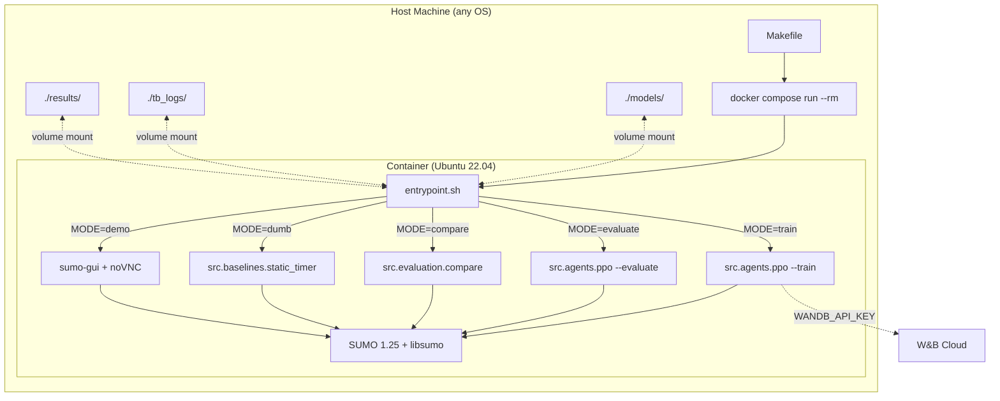

# Technical Architecture & Specifications

**Project: OpenTraffic-MARL**

This document defines the mathematical formulations, environment configurations, neural network
architectures, and training infrastructure used in the OpenTraffic-MARL framework.
It is intended for researchers and reviewers evaluating the reproducibility and technical depth of the project.

---

## 1. Environment Specifications (SUMO)

### 1.1 Simulation Engine

| Parameter | Value |
|-----------|-------|
| **Engine** | SUMO (Simulation of Urban Mobility) v1.25.0 |
| **Training Interface** | `libsumo` — in-process C++ binding, no socket overhead |
| **Evaluation Interface** | `traci` + `sumo-gui` — TCP-based, supports visual rendering |
| **Step Resolution** | 1 second per simulation step |
| **Episode Duration** | 3,600 simulation seconds (1 hour) |
| **Teleportation** | Disabled (`time-to-teleport = -1`) — vehicles never teleport |
| **Waiting Time Memory** | 1,000 seconds |

### 1.2 Network Topology

**Single 4-way signalized intersection** with the following geometry:

```
                 N
                 │
            ═════╪═════  (2 lanes per approach)
                 │
       W ────────┼──────── E
                 │
            ═════╪═════
                 │
                 S
```

| Parameter | Value |
|-----------|-------|
| **Junction Type** | `traffic_light` (node ID: `center`) |
| **Approach Arms** | 4 (North, South, East, West) |
| **Lanes per Approach** | 2 (index 0 and 1) |
| **Arm Length** | 200 meters |
| **Speed Limit** | 13.89 m/s (50 km/h) |
| **Bounding Box** | 400m × 400m |

**Incoming Lanes** (8 total, used as sensor inputs):

```
north_to_center_0, north_to_center_1
south_to_center_0, south_to_center_1
east_to_center_0,  east_to_center_1
west_to_center_0,  west_to_center_1
```

### 1.3 Traffic Light Phases

The junction operates with a 4-phase signal plan:

| Phase Index | Description | Signal State | Duration (default) |
|:-----------:|-------------|:------------:|:------------------:|
| 0 | NS Green | `GGGggrrrrrGGGggrrrrr` | 42s |
| 1 | NS Yellow | `yyyyyrrrrryyyyyrrrrr` | 5s |
| 2 | EW Green | `rrrrrGGGggrrrrrGGGgg` | 42s |
| 3 | EW Yellow | `rrrrryyyyyrrrrryyyyy` | 5s |

> **Note:** The RL agent overrides this default program. Yellow phases are enforced
> programmatically for exactly 5 seconds before every green-to-green transition.

### 1.4 Traffic Flow Dynamics

Vehicle flows are defined with Bernoulli arrival processes (independent per-second spawn probability):

| Flow | Route | Spawn Probability | Approx. Volume |
|------|-------|:-----------------:|:--------------:|
| **Through (N↔S, E↔W)** | Straight | `p = 0.11` | ~396 veh/hr |
| **Turning (all combos)** | Left/Right | `p = 0.04` | ~144 veh/hr |

**Vehicle Type:**

| Parameter | Value |
|-----------|-------|
| Acceleration | 2.6 m/s² |
| Deceleration | 4.5 m/s² |
| Driver imperfection (σ) | 0.5 |
| Vehicle length | 5 m |
| Max speed | 13.89 m/s |

**Total demand:** ~2,160 veh/hr across all approaches (moderate congestion regime).

---

## 2. Agent Architecture (Single Intersection)

### 2.1 Observation Space

The agent receives a **10-dimensional continuous vector** at each decision step:

$$\mathbf{s}_t = \left[ q_1, q_2, \ldots, q_8, \phi_t, \tau_t \right] \in \mathbb{R}^{10}$$

| Index | Feature | Range | Description |
|:-----:|---------|:-----:|-------------|
| 0–7 | $q_i$ | $[0, \infty)$ | Queue length (halting vehicles) on each of the 8 incoming lanes |
| 8 | $\phi_t$ | $\{0, 1\}$ | Current green phase (0 = NS, 1 = EW) |
| 9 | $\tau_t$ | $[0, \infty)$ | Seconds since last phase switch |

```python
observation_space = Box(low=0.0, high=np.inf, shape=(10,), dtype=np.float32)
```

### 2.2 Action Space

$$\mathcal{A} = \{0, 1\}$$

| Action | Effect |
|:------:|--------|
| 0 | **Keep** current green phase |
| 1 | **Switch** — initiate 5-second yellow, then transition to the opposing green |

```python
action_space = Discrete(2)
```

**Decision interval** ($\Delta t$): The agent acts every **5 simulation seconds**.
Between decisions, the simulation advances 5 steps (1s each).
During yellow phases, the agent's action is ignored until the yellow countdown completes.

### 2.3 Reward Function

The agent receives a composite reward signal designed to minimize queue buildup while
discouraging excessive phase switching (flickering) and severely punishing lane starvation:

$$R_t = -Q_t - \alpha \cdot \mathbb{1}[\text{switched}] - \sum_{l \in \text{lanes}} \left(\frac{W_{l,t}}{\beta}\right)^2$$

Where:

| Symbol | Definition | Default Value |
|--------|-----------|:------------:|
| $Q_t$ | $\sum_{i} q_i(t)$ — total halting vehicles across all incoming lanes | — |
| $\alpha$ | Phase switch penalty weight | 2.0 |
| $\mathbb{1}[\text{switched}]$ | Indicator: 1 if the agent chose action 1 (switch), 0 otherwise | — |
| $W_{l,t}$ | Total accumulated waiting time on lane $l$ (seconds) | — |
| $\beta$ | Scaling factor to prevent wait penalty from dominating early queues | 100.0 |

> **Design rationale:** The negative queue length provides a smooth, dense gradient signal.
> The switch penalty $\alpha$ prevents the agent from oscillating between phases every 5 seconds,
> which would degrade real-world signal timing. At $\alpha = 2.0$, a switch must reduce the
> queue by at least 2 vehicles to be worthwhile.

### 2.4 Episode Termination

- **Terminated:** When `step_count >= max_steps` (default: 3,600s = 720 decision steps at $\Delta t = 5$)
- **Truncated:** Never (no early termination)

### 2.5 Info Dictionary (Per-Step Metrics)

Each `env.step()` returns an `info` dict with:

| Key | Type | Description |
|-----|------|-------------|
| `queue_length` | float | Total halting vehicles across all lanes |
| `wait_time_total` | float | Sum of per-lane cumulative waiting times (s) |
| `reward` | float | Reward for this step |
| `switch_penalty` | float | Penalty applied (negative α or 0) |
| `throughput` | int | Number of vehicles that completed their trip this step |
| `step` | int | Current simulation time (seconds) |

---

## 3. Neural Network Architecture

### 3.1 Algorithm

**Proximal Policy Optimization (PPO)** via [Stable-Baselines3](https://stable-baselines3.readthedocs.io/).

PPO is a policy-gradient method that uses a clipped surrogate objective to constrain
policy updates, providing monotonic improvement guarantees:

$$L^{CLIP}(\theta) = \hat{\mathbb{E}}_t \left[ \min\left( r_t(\theta) \hat{A}_t, \; \text{clip}(r_t(\theta), 1 - \epsilon, 1 + \epsilon) \hat{A}_t \right) \right]$$

### 3.2 Policy Network

**Architecture:** Multi-Layer Perceptron (MLP) — `MlpPolicy` from SB3.

```
Input (10) → Linear(64) → Tanh → Linear(64) → Tanh → Policy Head (2) / Value Head (1)
```

| Layer | Input Dim | Output Dim | Activation |
|-------|:---------:|:----------:|:----------:|
| Hidden 1 | 10 | 64 | Tanh |
| Hidden 2 | 64 | 64 | Tanh |
| Policy (Actor) | 64 | 2 | Softmax (Categorical) |
| Value (Critic) | 64 | 1 | None |

> **Design rationale:** With a 10-dimensional state space, a compact [64, 64] MLP is
> sufficient and avoids overfitting. Training is CPU-bound (not GPU-bound) due to the
> small parameter count (~5K weights), making parallel CPU environments the primary
> throughput lever.

### 3.3 Parallelization

Training uses `SubprocVecEnv` with **N parallel environments** (default: 4).
Each subprocess runs an independent SUMO instance via `libsumo`.

```
SubprocVecEnv
├── Worker 0 (libsumo, seed=42)
├── Worker 1 (libsumo, seed=43)
├── Worker 2 (libsumo, seed=44)
└── Worker 3 (libsumo, seed=45)
```

Measured throughput: **~1,200–1,400 FPS** with 4 envs on a modern CPU.

---

## 4. Hyperparameters

All values are logged automatically to Weights & Biases on every training run.

| Hyperparameter | Symbol | Value | Description |
|---------------|:------:|:-----:|-------------|
| Algorithm | — | PPO | Proximal Policy Optimization |
| Learning Rate | $\eta$ | 3 × 10⁻⁴ | Adam optimizer step size |
| Rollout Length | `n_steps` | 512 | Steps collected per env before update |
| Mini-batch Size | `batch_size` | 128 | SGD mini-batch size |
| Epochs per Update | `n_epochs` | 10 | PPO passes over collected rollout |
| Discount Factor | $\gamma$ | 0.99 | Future reward discount |
| GAE Lambda | $\lambda$ | 0.95 | Generalized Advantage Estimation bias-variance tradeoff |
| Clip Range | $\epsilon$ | 0.2 | PPO clipping parameter |
| Decision Interval | $\Delta t$ | 5s | Simulation seconds between agent actions |
| Switch Penalty | $\alpha$ | 2.0 | Reward penalty for phase switches |
| Yellow Duration | — | 5s | Mandatory yellow before green-to-green |
| Parallel Environments | — | 4 | `SubprocVecEnv` workers |
| Total Timesteps | — | 100,000 | Default training length (configurable via `--timesteps`) |

---

## 5. Static-Timer Baseline

For controlled comparison, a **fixed-cycle controller** provides a non-learning baseline:

| Parameter | Value |
|-----------|-------|
| Green Duration | 40 seconds per phase |
| Yellow Duration | 5 seconds (handled by env) |
| Cycle Length | 90 seconds (40s green + 5s yellow + 40s green + 5s yellow) |
| Decision Rule | Switch when `time_in_phase >= 40s`, else keep |

**Baseline Result (1-hour episode):**

| Metric | Static Timer | PPO (100K steps) | Improvement |
|--------|:------------:|:-----------------:|:-----------:|
| Total Reward | −11,162 | −4,088 | **+63.4%** |
| Avg Queue Length | 15.2 | 4.7 | **3.2× lower** |

---

## 6. Stage 2: 2×2 Grid — Independent Multi-Agent

### 6.1 Grid Topology

```
       top0     top1
        |        |
left1--[A1]----[B1]--right1
        |        |
left0--[A0]----[B0]--right0
        |        |
     bottom0  bottom1
```

| Parameter | Value |
|-----------|-------|
| Grid dimensions | 2×2 (4 signalized junctions) |
| Junction IDs | `A0`, `A1`, `B0`, `B1` |
| Arm length | 200m (inter-junction) + 200m (boundary attach) |
| Lanes per approach | 2 |
| Incoming lanes per junction | 8 |
| Total incoming lanes | 32 |

Generated via: `netgenerate --grid --grid.x-number 2 --grid.y-number 2 --grid.x-length 200 --grid.y-length 200 --grid.attach-length 200 --default.lanenumber 2 --tls.guess`

### 6.2 Traffic Flows

| Flow Type | Probability | Volume (per flow) |
|-----------|:-----------:|:-----------------:|
| Through (N↔S, E↔W) | `p = 0.10` | ~360 veh/hr |
| Turning (cross-grid) | `p = 0.03` | ~108 veh/hr |

### 6.3 Multi-Agent Architecture

**Approach:** Independent PPO (zero-shot cloning from single-intersection model).

Each junction is controlled by a **clone** of the trained single-intersection PPO model.
Agents share weights but act independently — no communication between junctions.

| Property | Value |
|----------|-------|
| Agents | 4 (one per junction) |
| Observation per agent | 10-dim vector (identical to single intersection) |
| Action per agent | Discrete(2) — keep / switch |
| Reward per agent | $-Q_j(t) - \alpha \cdot \mathbb{1}[\text{switched}_j]$ |
| Global reward | $\sum_{j \in \{A0,A1,B0,B1\}} R_j(t)$ |
| Model weights | Loaded from `models/ppo_traffic.zip` (no retraining) |

### 6.4 Grid Static-Timer Baseline

| Parameter | Value |
|-----------|-------|
| Green Duration | 30 seconds per phase |
| Yellow Duration | 5 seconds |
| Applied to | All 4 junctions simultaneously |

---

## 7. Stage 3: Cologne8 RESCO Benchmark — Independent PPO

### 7.1 Network Topology

The Cologne8 network is a traffic management benchmark from the RESCO (Reinforcement Learning Benchmarks for Traffic Signal Control) suite. It consists of 8 closely coupled, signalized intersections in a busy corridor, natively emphasizing the "green wave" and corridor coordination problems.

| Parameter | Value |
|-----------|-------|
| Corridor | 8 coordinated intersections (Cologne, Germany) |
| Junctions Controlled | 8 (named dynamically via clustering) |
| Transport Modes | Passenger |

### 7.2 Multi-Agent Execution

Each junction gets its own uniquely-sized PPO model (`MlpPolicy`). The action space represents **"target green phase index"**. If the agent selects an action different from its current phase, a mandatory 5-second yellow transition is injected. Additionally, a **15-second minimum green phase** constraint is strictly enforced to maintain realistic physical constraints and the Markov property.

| Junction Index | Valid Phases | Obs Dim | Action Space |
|:-----:|:------------:|:-------:|:------------:|
| 0 | 4 | 8 | Discrete(4) |
| 1 | 2 | 6 | Discrete(2) |
| 2 | 3 | 5 | Discrete(3) |
| 3 | 4 | 8 | Discrete(4) |
| 4 | 3 | 6 | Discrete(3) |
| 5 | 2 | 4 | Discrete(2) |
| 6 | 3 | 6 | Discrete(3) |
| 7 | 4 | 6 | Discrete(4) |

### 7.3 Curriculum Learning

The training is structured using curriculum learning to smoothly ramp up the difficulty:

| Grade | `scale` | Progress threshold | Description |
|:-----:|:-------:|:-----------------:|-------------|
| 1 | 0.60 | 0–15% | Foundational: clearing light traffic |
| 2 | 0.80 | 15–40% | Moderate pressure, queue management |
| 3 | 1.00 | 40–100% | Full RESCO benchmark demand |
| Eval | 1.00 | — | Evaluation benchmark |

The Multi-Agent PPO system uses a multi-processed `SubprocCoordinator` pattern to multiplex actions from independent `PPO.learn()` threads across parallel SUMO worker processes via `multiprocessing.Pipe`.

---

## 8. Experiment Tracking & Reproducibility

### 7.1 Weights & Biases Integration

Every training run automatically captures:

| Data | Method |
|------|--------|
| All hyperparameters | `wandb.init(config={...})` |
| Training curves (reward, loss, entropy, KL) | `sync_tensorboard=True` |
| Per-step env metrics | Custom `MetricsCallback` → `wandb.log()` |
| Gradient histograms | `WandbCallback(gradient_save_freq=100)` |
| Model weights | Versioned W&B Artifact (`ppo_traffic_model:v0`, `v1`, ...) |
| Git commit hash | Auto-captured by W&B |
| CLI command used | Auto-captured by W&B |
| Source code snapshot | `save_code=True` |

**W&B Mode Selection (priority order):**

| Condition | Mode |
|-----------|------|
| `--timesteps < 1000` or `--run-name sanity*` | `disabled` (no overhead) |
| `~/.netrc` has `api.wandb.ai` credentials | `online` (preferred — via volume mount) |
| `WANDB_API_KEY` env var is set | `online` |
| No credentials found | `offline` (local file only) |

Credentials are injected into the container via `docker-compose.yml` volume mounts (`~/.netrc` → `/root/.netrc`), meaning **no rebuild is needed** after `make wandb-login`.

### 7.2 Custom Run Labelling

```bash
# CLI flags for intuitive experiment tracking
--run-name "baseline"                    # Short identifier for W&B dashboard
--notes "Original reward with α=2.0"    # Detailed experiment description
--compare-static                         # Auto-run vs static timer after training
```

### 7.3 Live Monitoring Stack

| Service | Port | Purpose |
|---------|:----:|---------|
| Prometheus | 9010 | Time-series metrics scraping (5s interval) |
| Grafana | 3000 | Real-time dashboard (5 panels: queue, wait, reward, penalty, throughput) |
| TensorBoard | 6006 | Training curves (PPO loss components) |
| noVNC | 6080 | Browser-streamed SUMO GUI demo |

### 7.4 Prometheus Gauges

```python
traffic_queue_length      # Halting vehicle count (all lanes)
traffic_wait_time_total   # Cumulative waiting time (seconds)
agent_reward_total        # Per-step reward signal
agent_switch_penalty      # Phase switch penalty applied
traffic_throughput        # Vehicles arrived (completed trip) per step
```

---

## 9. Infrastructure

### 8.1 Reproducibility Model

All experiments execute inside Docker containers, eliminating host-specific dependencies
(Python version, SUMO build, library versions). The only requirement on the host is Docker.


```mermaid
graph TB
    subgraph "Host Machine (any OS)"
        M[Makefile] --> DC[docker compose run --rm]
        DC --> C
        subgraph "Container (Ubuntu 22.04)"
            C[entrypoint.sh] --> |MODE=train| T[src.agents.ppo --train]
            C --> |MODE=evaluate| E[src.agents.ppo --evaluate]
            C --> |MODE=compare| CP[src.evaluation.compare]
            C --> |MODE=dumb| D[src.baselines.static_timer]
            C --> |MODE=demo| DM[sumo-gui + noVNC]
            T --> SUMO[SUMO 1.25 + libsumo]
            E --> SUMO
            CP --> SUMO
            D --> SUMO
            DM --> SUMO
        end
        V1[./models/] <-.->|volume mount| C
        V2[./tb_logs/] <-.->|volume mount| C
        V3[./results/] <-.->|volume mount| C
    end
    T -.->|WANDB_API_KEY| W[W&B Cloud]
```

**Isolation guarantees:**
- SUMO version is pinned in the Dockerfile (`ppa:sumo/stable`)
- Python packages are pinned via `requirements.txt`
- The container is stateless — all persistent data lives on the host via volume mounts
- `docker compose run --rm` creates a fresh container for each experiment

### 8.2 Execution Model

Every experiment command maps to a Docker Compose service invocation:

```bash
make train ARGS="--run-name baseline --timesteps 100000"
# ↓ translates to:
docker compose run --rm -e MODE=train agent --run-name baseline --timesteps 100000
```

| Make Target | MODE | Container Entry Point | Persistent Output |
|------------|:----:|----------------------|-------------------|
| `make train` | `train` | `src.agents.ppo --train` | `models/`, `tb_logs/` |
| `make eval` | `evaluate` | `src.agents.ppo --evaluate` | — |
| `make dumb` | `dumb` | `src.baselines.static_timer` | — |
| `make compare` | `compare` | `src.evaluation.compare` | `results/` |
| `make demo` | `demo` | `src.agents.ppo --demo` + noVNC | — |

### 8.3 Dual SUMO Backend

Inside the container, the environment dynamically selects the SUMO interface:

| Mode | API | Binary | Purpose |
|------|-----|--------|---------|
| Training / Evaluation / Compare | `libsumo` | `sumo` (in-process) | Maximum throughput — no IPC overhead |
| Demo | `traci` | `sumo-gui` (subprocess) | Visual rendering via Xvfb → x11vnc → noVNC |

### 8.4 Persistent Volume Mounts

All experiment outputs survive container teardown via host-mounted directories:

| Host Path | Container Path | Content |
|-----------|:--------------|---------|
| `./models/` | `/app/models/` | Saved model weights (`.zip`) |
| `./tb_logs/` | `/app/tb_logs/` | TensorBoard event files |
| `./results/` | `/app/results/` | Comparison CSVs and plots |

### 8.5 W&B Credential Management

The W&B API key is passed to the container via the `WANDB_API_KEY` environment variable:

```bash
export WANDB_API_KEY=<your_key>    # set once per shell session
make train ARGS="--run-name ..."   # key is forwarded into the container
```

This is read by `docker-compose.yml`:
```yaml
environment:
  - WANDB_API_KEY=${WANDB_API_KEY:-}
```

### 8.6 Docker Services

| Service | Image | Ports | Profile |
|---------|-------|:-----:|:-------:|
| `agent` | Local build (Ubuntu 22.04 + SUMO + Python) | 8000 | default |
| `demo` | Local build | 6080, 8001 | `demo` |
| `prometheus` | `prom/prometheus:latest` | 9010 | default |
| `grafana` | `grafana/grafana:latest` | 3000 | default |
| `tensorboard` | `tensorflow/tensorflow:latest` | 6006 | `monitoring` |

### 8.7 File Structure

```
marl/
├── src/
│   ├── envs/                              # Gymnasium environments
│   │   ├── __init__.py                    # ENV_REGISTRY — lookup by name
│   │   └── single_intersection.py         # 4-way single intersection
│   ├── agents/                            # RL agents
│   │   └── ppo.py                         # PPO train / evaluate / demo
│   ├── baselines/                         # Non-learning controllers
│   │   └── static_timer.py                # Fixed 40s green cycle
│   ├── evaluation/                        # Comparison & analysis
│   │   └── compare.py                     # Static vs PPO comparison + W&B
│   └── utils/                             # Shared utilities
│       └── metrics.py                     # Prometheus gauge definitions
├── sumo_net/
│   └── single_intersection/               # Network files (organized by topology)
│       ├── intersection.net.xml
│       ├── intersection.nod.xml
│       ├── intersection.edg.xml
│       ├── intersection.rou.xml
│       └── intersection.sumocfg
├── docker/
│   └── entrypoint.sh                      # Multi-mode container entrypoint
├── prometheus/
│   └── prometheus.yml                     # Scrape configuration
├── grafana/
│   ├── provisioning/                      # Auto-provisioned datasource
│   └── dashboards/                        # Pre-built traffic dashboard JSON
├── Dockerfile                             # Ubuntu 22.04 + SUMO + Python deps
├── docker-compose.yml                     # Service definitions + volume mounts
├── Makefile                               # Docker-first CLI interface
├── requirements.txt
├── TECHNICAL.md                           # This document
└── README.md                              # Quick start guide
```

---

## 9. Phase 3: CTDE MAPPO Architecture

### 9.1 Overview

Phase 3 implements **Centralized Training, Decentralized Execution (CTDE)** using MAPPO (Multi-Agent PPO) on the Cologne8 benchmark. It serves as a direct comparison against Independent PPO (Stage 3).

**Core principle:**
- **Training** — A shared Central Critic observes the full global state (all agents' observations concatenated) and produces a better value estimate for computing advantages.
- **Execution** — The critic is discarded. Each agent uses **only its local observation** through its individual decentralized Actor.

### 9.2 Network Architecture

**Per-Agent Actor** (`MAPPOActor`) — one per junction, heterogeneous weights:

```
Input: local obs o_i  (dim = obs_dim_i, varies per junction type)
  → Linear(obs_dim_i, 64) → Tanh
  → Linear(64, 64)        → Tanh
  → Linear(64, n_actions_i)
Output: action logits (Categorical distribution over green phases)
```

**Shared Central Critic** (`MAPPOCritic`) — shared trunk, per-agent output heads:

```
Input: global_state s = concat(f_1, f_2, ..., f_N)
       where f_i is a handcrafted 5-dim vector for junction i.
       → global_dim = 8 junctions × 5 = 40

       The 5 features per junction are:
       1: total_queue (normalized / 20.0)
       2: max_lane_queue (normalized / 10.0)
       3: mean_wait_time (normalized / 300.0s)
       4: phase_index_norm (idx / (n_phases - 1))
       5: time_since_switch_norm (time / max_steps)

  Shared Trunk:
    → Linear(40, 128) → Tanh
    → Linear(128, 64) → Tanh
    → features  (dim=64)

  Per-Agent Heads (8 heads, one per junction):
    → Linear(64, 1) for agent i  →  V_i(s)  (scalar per agent)
```

**Why per-agent heads?** Junctions differ enormously in reward scale. A single output head trained on their average target diverges. Per-agent heads let each junction calibrate its own value scale while still sharing the global-state representation in the trunk.

**Heterogeneous obs handling:** The central critic avoids padding raw heterogeneous observations by relying on the handcrafted 5-dim signal per junction, dramatically reducing input noise compared to raw padded vectors.

### 9.3 Loss Functions

**Actor loss (per-agent, PPO clipped surrogate):**

$$\mathcal{L}_{\text{actor}}^i = -\mathbb{E}_t \left[ \min\left( r_t^i \hat{A}_t^i,\ \text{clip}(r_t^i, 1-\epsilon, 1+\epsilon) \hat{A}_t^i \right) \right]$$

**Critic loss (shared, MSE on avg returns):**

$$\mathcal{L}_{\text{critic}} = \mathbb{E}_t \left[ \left( V_\phi(s_t) - \bar{R}_t \right)^2 \right]$$

where $\bar{R}_t$ is the mean discounted return across all agents.

**Entropy bonus (per-actor):**

$$\mathcal{L}_{\text{entropy}}^i = -c_{\text{ent}} \cdot \mathcal{H}[\pi_{\theta_i}(\cdot | o_t^i)]$$

**GAE advantage** (using centralized critic values $V(s_t)$, local rewards $r_t^i$):

$$\hat{A}_t^i = \sum_{k=0}^{T-t-1} (\gamma \lambda)^k \delta_{t+k}^i, \quad \delta_t^i = r_t^i + \gamma V(s_{t+1}) - V(s_t)$$

### 9.4 Hyperparameters

| Parameter | Value |
|-----------|------:|
| Discount factor γ | 0.99 |
| GAE λ | 0.95 |
| PPO clip ε | 0.2 |
| Entropy coef (annealed) | 0.05 → 0.003 |
| Value coefficient | 0.5 |
| Actor learning rate | 3×10⁻⁴ |
| Critic learning rate | 3×10⁻⁴ |
| Training episode length | 3600s |
| Rollout steps N | 720 (sub-episode) |
| PPO epochs | 10 |
| Batch size | 90 |
| Max gradient norm | 0.5 |
| Eval static timer GREEN_DUR | 30s / all phases |

**Entropy annealing rationale:** A fixed high entropy coefficient (0.05) caused actors to stay near-random through all of training (W&B showed per-agent entropy ≈ 0.77 at step 500k, close to max for small action spaces). Linear decay from 0.05→0.003 preserves early-stage exploration while ensuring actors commit to learned strategies by the end of training.

**Episode length rationale:** Training was previously on 1800s episodes while eval runs 3600s — actors never experienced the dense traffic that builds in the second half of the episode. Training now uses 3600s to match eval. Rollout buffer is set to N=720 (sub-episode) to inject reset diversity into each PPO update.

**Static timer baseline fix:** The comparison step function previously binary-cycled (phase % 2) all junctions regardless of their phase count. Junctions with 3–6 phases were permanently stuck using only 2 of them. The static timer now cycles through all `n_phases[t]` phases from the action space.

### 9.5 Curriculum

Same re-calibrated curriculum as Independent PPO training:

| Grade | `scale` | Progress threshold |
|:-----:|:-------:|:-----------------:|
| 1 | 0.60 | 0–15% |
| 2 | 0.80 | 15–40% |
| 3 | 1.00 | 40–100% |

### 9.6 Evaluation & Comparison

At evaluation time, only the trained actors are loaded — the critic is discarded. Deterministic actions are selected via `argmax` over actor logits.

**Multi-episode averaging:** To eliminate evaluation noise from stochastic traffic spawns,
each system runs **10 independent episodes** (`N_EVAL_EPISODES=10`). Results are reported
as mean ± standard deviation for statistical significance.

**Train/eval alignment:** Evaluation uses `max_steps=1800` — identical to the training
episode length — ensuring the policy is tested on the exact traffic horizon it was
optimised for.

**3-way comparison** (`make ctde-compare`):
1. Static Timer baseline (all-phase cycling, `GREEN_DUR=30s`)
2. Independent PPO (Phase 2 weights)
3. CTDE MAPPO (Phase 3 weights)

All three are run on the same environment configuration (`scale=2.0`, `max_steps=1800`,
`N_EVAL_EPISODES=10`) and a unified bar-chart comparison plot with error bars is generated
and uploaded to W&B.

### 9.7 Commands

```bash
# Train CTDE MAPPO agents
make ctde-train ARGS="--timesteps 500000 --run-name ctde-run-1"

# Headless decentralized evaluation (no critic)
make ctde-eval

# 3-way comparison plot (Static vs IndePPO vs CTDE)
make ctde-compare

# Visual demo (open http://localhost:6080)
make ctde-demo
```

---

## 10. Phase 4: Feudal MARL Architecture

### 10.1 Overview

Phase 4 implements a hierarchical **Feudal MARL** architecture designed to bridge the gap between macroscopic systemic goals and microscopic high-frequency traffic phase optimization. 

**Core principle:**
- **Manager (Macroscopic)** — Operates at a low frequency ($c=4$ environmental steps, corresponding to $60s$ of simulation elapsed time). It observes the global state and outputs explicit behavioral **Priority Vectors** ($g_i \in [0, 1]^3$) for each local junction worker.
- **Workers (Microscopic)** — Operate at high frequency ($1$ environmental step, corresponding to $15s$ of minimum green times constraint). They append their assigned priority vector into their observation space and act independently to optimize a shaped intrinsic reward.

### 10.2 Goal Formulation & Abstraction

The Manager generates goals representing **traffic optimization priorities**:
1. **Queue Size Management:** Clear buildup of halted vehicles.
2. **Current Wait Time:** Prevent large accumulated waits on currently halted lanes.
3. **Starvation Avoidance:** Prevent a specific lane from waiting indefinitely.

Goals $g_i = [w_{queue}, w_{wait}, w_{starved}]$ are bounded within $[0, 1]^3$ via the `BoundedTanh` function, giving each worker mathematically interpretable objective weightings.

**Zero-Order Hold:** Between Manager step $T$ and $T+c$, the generated goals $g$ are cached locally by workers to construct their environment observations.

**Goal Dropout:** ~10% randomly masked Goals. This functions phenomenally as a training regularization technique, ensuring intersections don't completely lock up if Manager oversight is somehow lost or degraded.

### 10.3 Reward Construction

**Extrinsic Global Reward:**
Calculated normally as the aggregate of penalties across all intersections. Used directly by the Manager PPO loop to optimize long-horizon global efficiency.

**Intrinsic Worker Reward:**
$$R_{worker} = \alpha R_{ext} + (1 - \alpha) R_{int}$$
Where $\alpha = 0.5$, and $R_{int} = - \mathbf{g}_i \cdot \mathbf{m}_i$. 
$\mathbf{m}_i$ consists of normalized local traffic statistics at the worker node. This forces the worker to explicitly lower the local metrics that the Manager assigned the highest weights to via $g_i$.

### 10.4 Execution Model & Commands

The model maintains separate Rollout Buffers and independent PPO optimizers for the multi-dimensional Manager (continuous action space) vs the Workers (discrete MultiDiscrete action space). 

```bash
# Train hierarchical Feudal MARL system
make feudal-train ARGS="--run-name feudal-run-1 --timesteps 500000"
```
